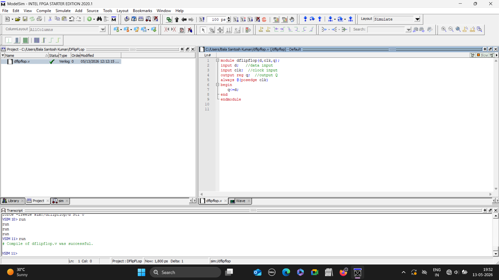
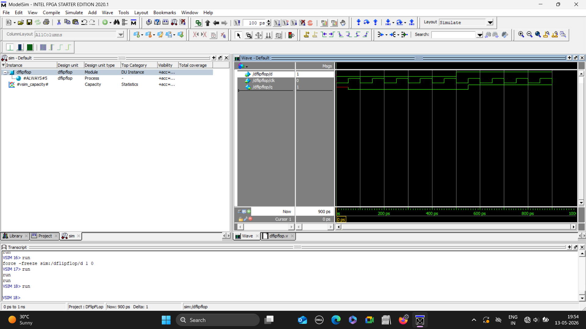

# D FlipFlop using Verilog

## Objective
Implemented and stimulated a D flip flop using Verilog HDL in Modelsim.

## Concepts used
- Sequential logic
- Edge triggered Flip Flop
- Clocked digital circuit
  

  

## Verilog Code 

## Simulation Waveform

## Results
Verilog output follows input at active clock edge.

## Tools used
- Verilog HDL
- Modelsim
